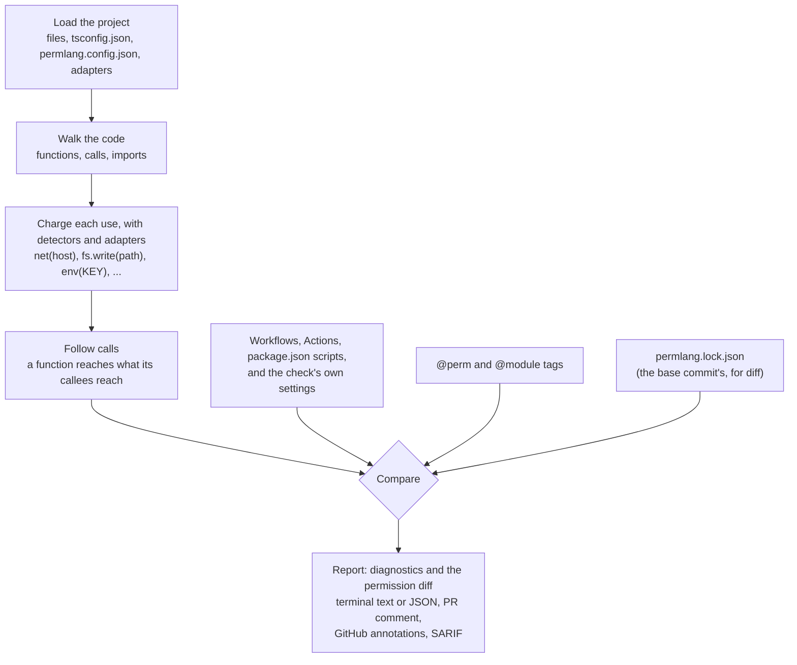

# PermLang design

How PermLang is put together: who and what it works with, what each command
does, and every interface it has with the outside world.

1. [What PermLang is](#what-permlang-is)
2. [Actors](#actors)
3. [Actions](#actions)
4. [Components](#components)
5. [External interfaces](#external-interfaces)
6. [Data and storage](#data-and-storage)
7. [Design decisions](#design-decisions)

This is the high-level design. The [reference](reference.md) has every option,
rule, and message format. The [threat model](threat-model.md) covers trust
boundaries and the security assessment.

## What PermLang is

PermLang is a build-time permission checker for TypeScript. It reads your code
with the TypeScript compiler, never running it, and works out what each function
can reach: network hosts, files, database tables, environment variables,
processes, and app-level actions such as `payments.refund`. It compares that with
the permissions you declare in `@perm` tags and with the inventory you approved in
`permlang.lock.json`, and reports every difference. It ships as one npm package,
`permlang` (a command-line tool and a JavaScript library), and as a GitHub Action
that runs the same tool on pull requests.

1. **Load** the settings, the files, and the adapter manifests.
2. **Walk** the code: each function, method, and file's top-level code is a
   unit, and the calls between units are edges of a call graph.
3. **Charge** each direct use (`fetch`, `fs`, `process.env`, Prisma, SQL, ...)
   and each library call an adapter maps. A host or path that can't be read gives
   the bare capability (`net`); code whose effect can't be known is `unverifiable`.
4. **Follow** calls: a unit reaches everything its callees reach.
5. **Compare** with `@perm`, the strictness level, flow rules, the AI-tool
   policy, and the lock, which also records workflows, `package.json` scripts,
   and the settings.
6. **Report** diagnostics ([codes](reference.md#diagnostic-codes)) as text,
   JSON, annotations, or SARIF. `permlang diff` turns lock changes into the
   pull-request comment.

## Actors

PermLang has no server, no accounts, and no telemetry. Everyone below works with
it through files in a repository, a command line, or GitHub.

**Around a project that uses PermLang:**

| Actor | What they do | How PermLang treats it |
| --- | --- | --- |
| **Developer**, on their own machine | Runs `npx permlang init`, `check`, `lock`, `diff`, or `spec`. Adds `@perm` tags, adapters, and flow rules. | Reads the project, writes only the files a command names, and sends nothing anywhere. |
| **Pull-request author**: a person or an AI coding agent, possibly from a fork, possibly untrusted | Changes code, settings, workflows, `package.json`, and the lock file itself. | As untrusted input. Outside the documented [known limits](reference.md#known-limits), any change to what the code reaches, what the configuration grants, or how the check runs fails the check or shows in the comment. A pull request can also edit the workflow that runs PermLang, so [protect it](reference.md#github-action) with a required check and code owners. |
| **Reviewer** | Reads the comment, the annotations on changed lines, the job summary, and the lock file's own diff, then approves or asks for changes. | Shows new access first, says when the diff is incomplete, and escapes text from the code so it can't change what the comment says. |
| **Lock owner** (a maintainer of the project) | Runs `permlang lock` to approve a change and commits it. Chooses strictness, policies, adapters, and flow rules. Sets up branch protection. | Nothing counts as approved until the lock records it. |
| **Adapter author** | Writes JSON manifests that say what a library's functions reach. | Trusts them as written. A team's adapter takes precedence over a built-in one, and the lock records each team adapter with a hash of its content. |
| **GitHub Actions runner** | Runs your workflow's jobs: one that installs your dependencies and uploads them, and one where the Action checks, with the job's `GITHUB_TOKEN`. | Nothing from the pull request runs in the check's job: the Action brings in only the uploaded `node_modules` folders. Its only writes through the GitHub API are its comment (with the `github-token` token) and, with `sarif: true`, the code-scanning upload. On pushes, and scheduled and manual runs, it also saves its own build to the Actions cache. |
| **GitHub** | Hosts the repository, runs workflows, serves the Action's source at the ref in `uses:`, and stores comments, annotations, job summaries, code-scanning alerts, and the Action's build cache. | Receives PermLang's results. Never your source files. |
| **npm registry** | Serves the `permlang` package. Serves PermLang's own dependencies when the Action builds itself. | The command line never contacts it. |
| **Other tools** | Read `--json` or SARIF output, or call the library. | Get the same results the terminal shows. |

**PermLang's own project:**

| Actor | What they do |
| --- | --- |
| **Maintainer** | Reviews and merges pull requests, creates GitHub releases, and relocks `permlang.lock.json` and `permlang.released.lock.json`. |
| **CI** ([ci.yml](../.github/workflows/ci.yml)) | Type-checks, lints, tests on Node 20 to 26 (and on Windows), builds, smoke-tests the CLI, makes the SBOM, checks that building twice gives the same package, and uploads coverage to Codecov, signing in with OIDC rather than a stored secret. |
| **Pull-request checks** ([sign-off.yml](../.github/workflows/sign-off.yml), [dependency-review.yml](../.github/workflows/dependency-review.yml)) | Check that every commit is signed off by its author, and review new and updated dependencies for known vulnerabilities and licenses ([policies.md](policies.md)). |
| **Self-check** ([permlang.yml](../.github/workflows/permlang.yml)) | Runs PermLang on its own `src`, twice (see [design decisions](#design-decisions)). |
| **Release workflow** ([release.yml](../.github/workflows/release.yml)) | On a published GitHub release: a read-only `build` job checks the tag and that the commit is on `main`, installs without install scripts, tests, and packs. A read-only `sbom` job lists every package installing PermLang installs. A `publish` job that installs nothing attests the tarball and the SBOM, publishes the tarball to npm through trusted publishing (OIDC), attaches it, its provenance, and the SBOM to the release, and moves the `v0` tag that `PermLang/permlang@v0` follows. See [releasing.md](releasing.md). |
| **Dependabot** ([dependabot.yml](../.github/dependabot.yml)) | Opens weekly pull requests for npm packages and GitHub Actions, minor and patch updates grouped. When it moves the pinned release in `permlang.yml`, the maintainer relocks `permlang.released.lock.json` in that pull request. |
| **OpenSSF Scorecard** ([scorecard.yml](../.github/workflows/scorecard.yml)) | Weekly and on each push to `main`, checks the repository's security practices and publishes the score. |
| **Security reporters** | Report vulnerabilities privately through the repository's Security tab ([SECURITY.md](../SECURITY.md)). |

## Actions

### Commands

The `permlang` command has five commands ([main.ts](../src/main.ts)). Which
files a command analyzes: the paths given, or `--project <tsconfig.json>`; with
neither, `./tsconfig.json` if present, else `./src`. The project's own files that
those import are analyzed too.

| Command | What it does | Reads, besides the code | Writes | Exit codes |
| --- | --- | --- | --- | --- |
| `init [paths]` | Sets up a project. Keeps any file that already exists. | Existing config, workflow, and lock. With `--workflow`: `git` for the repository root and default branch, and the nearest package-manager lockfile. | `permlang.config.json` (`"strictness": "sketch"` unless `--strictness` says otherwise); with `--workflow`, `.github/workflows/permlang.yml` at the repository root (`permlang-<folder>.yml` for a subfolder); then `permlang.lock.json`. | 0, 2 |
| `check [paths]` | Analyzes the code, compares it with `@perm` tags and the lock, and prints a report. | Config, adapters, lock, project configuration. With `--base <ref>`: that commit's lock and workflows, through `git`. | Only `--sarif <file>`. | 0, 1, 2 |
| `lock [paths]` | Records what the code reaches now, and prints what changed since the old lock. | Config, adapters, project configuration, the old lock. | The lock file. | 0, 2 |
| `diff [base-ref] [paths]` | Shows what changed since `base-ref` (default `HEAD`): new and removed access, changed settings, new code PermLang can't check, new dependencies, and which AI tools can reach each new capability. | The base commit's lock, `package.json`, and workflows, through `git`; the working tree's lock; `node_modules/<name>/package.json` for new dependencies. | Only `--summary <file>`. | 0, also when there are changes or the code couldn't be analyzed (the output says so); 2 |
| `spec [paths]` | Checks each `.perm` spec's `perms:` against the code that implements it. | `.perm` files, config, adapters. | Nothing. | 0, 1, 2 |

`permlang --version` (`-v`), `permlang --help`, and `permlang <command> --help`
exit 0. `permlang` with no arguments prints the usage and exits 2.

Every command takes the options that choose files and settings (`--project`,
`--config`, `--adapter`, `--strictness`, `--unmapped`, `--lock`). `check` adds
`--no-lock`, `--require-lock`, `--base`, `--json`, `--github-annotations`, and
`--sarif`. `diff` takes `check`'s options except `--base`, plus `--head`,
`--format`, and `--summary`. `init` adds `--workflow`; `spec` adds `--json` and
`--spec`. An option the command doesn't take is an error ([args.ts](../src/args.ts)).
Details: [command line](reference.md#command-line).

### What the GitHub Action does

[action.yml](../action.yml) is a composite Action. In order, it:

1. Finds Node 22 in the runner's tool cache, or installs it with
   `actions/setup-node`. It runs PermLang with that Node by its full path.
2. Builds PermLang: `npm ci --ignore-scripts` and `npm run build` in the
   Action's folder. On pushes, and scheduled and manual runs, it first restores
   the build from the Actions cache, keyed by the runner's OS and a hash of
   PermLang's own sources and lockfile, and saves it on a miss. Pull requests and
   merge-queue entries always build from the sources, since a pull request can
   write to the cache it reads.
3. With the `dependencies` input: downloads the archive another job uploaded,
   and brings in its `node_modules` folders (and the folders `generated` names),
   refusing the whole archive if it has anything else
   ([dependencies.ts](../src/dependencies.ts)). When there's nothing to
   download, because that job failed, the step fails, and says why.
4. On a pull request or merge-queue entry, makes sure the base commit is present,
   fetching just that commit when it isn't, with `github-token` when the checkout
   kept no credentials.
5. Runs `permlang check <args> --github-annotations`, adding `--strictness`,
   `--base <base commit>` (or `--require-lock` when the base couldn't be
   fetched), and `--sarif` as the inputs ask. In GitHub Actions, PermLang first
   tells the runner to ignore workflow commands until a token only that run
   knows, so text from the code can't start one.
6. With `sarif: true`, uploads the SARIF file to code scanning. A failed upload
   doesn't fail the job.
7. On `pull_request` with `comment: true`: runs
   `permlang diff <base> <args> --format markdown --summary <file>`, writes the
   job summary, and posts its comment or updates the one it posted before. For a
   pull request from a fork, it stops after the job summary. When the diff
   prints nothing, the step fails rather than leave an earlier comment looking
   current.
8. Exits with the check's exit code, which fails the job on 1 or 2.

The workflow around it has two jobs, as `permlang init --workflow` writes it:
one installs the dependencies, with a read-only token, and uploads every
`node_modules` folder; the other checks out the code and runs the Action, and
nothing from the pull request runs in it. The check's job has `if: always()`,
so a failed install fails the check instead of skipping it, which GitHub would
count as passed ([reference](reference.md#github-action)).

## Components

All source is in [src/](../src); the reference's [development](reference.md#development) section lists it file by file.

| Group | Modules | Responsibility |
| --- | --- | --- |
| Command line | [cli.ts](../src/cli.ts), [main.ts](../src/main.ts), [args.ts](../src/args.ts), [init-workflow.ts](../src/init-workflow.ts) | The executable, the five commands, which options each takes, and the workflow `init --workflow` writes. |
| Loading | [load.ts](../src/load.ts), [settings.ts](../src/settings.ts), [adapters.ts](../src/adapters.ts) | Builds the TypeScript project (a file too deeply nested to parse is read as empty and reported unverifiable). Reads `permlang.config.json` and `tsconfig.json`, and turns the settings into lock entries. Loads, validates, and matches adapter manifests. |
| Capabilities and annotations | [capability.ts](../src/capability.ts), [annotations.ts](../src/annotations.ts) | The capability vocabulary and when a declared permission covers a use. Reads `@perm`, `@perm-unsafe`, and `@module` tags from JSDoc. |
| Walking | [walk.ts](../src/walk.ts), [units.ts](../src/units.ts), [graph.ts](../src/graph.ts), [dispatch.ts](../src/dispatch.ts) | Walks syntax trees without recursion. Finds the units permissions attach to, builds the call graph, and propagates reach along it, including calls through interfaces, base classes, callable types, and collections of functions. |
| Detectors | [detect/](../src/detect) `index`, `fetch`, `fs`, `env`, `web`, `modules`, `module-format`, `values`, `computed`, `escapes`, `functions`, `shared` | Direct uses: `fetch`, `fs`, the environment, Node and web globals, module loads, functions used as values, computed calls, capabilities hidden behind `any`, and code that can't be verified. |
| Database detectors | [detect/](../src/detect) `prisma`, `prisma-args`, `drizzle`, `sql`, `sql-tables` | Prisma, Drizzle, and raw SQL clients. Table names come from literal SQL only when the reader fully understands it. |
| Checking | [check.ts](../src/check.ts) | Runs the analysis, compares declared with actual for each unit, applies strictness and policies, and builds the report. |
| Code PermLang can't check | [unmapped.ts](../src/unmapped.ts), [unchecked.ts](../src/unchecked.ts), [unseen.ts](../src/unseen.ts) | Packages with no adapter, imports with no types, their lock entry, and what a spec's implementation reaches that can't be seen. |
| Flows | [flows.ts](../src/flows.ts) | Data-flow rules: parsing them, and finding functions that break them (`PERM009`). |
| AI tools | [tools.ts](../src/tools.ts) | Tool registrations for AI models, their handlers, and what each reaches (`PERM008`). |
| Configuration inventory | [project-files.ts](../src/project-files.ts), [workflow-files.ts](../src/workflow-files.ts), [yaml-nodes.ts](../src/yaml-nodes.ts), [ci-expressions.ts](../src/ci-expressions.ts), [package-files.ts](../src/package-files.ts) | Workflows, Actions, `package.json` scripts, and workspace packages as lock entries, with YAML and expressions read the way GitHub reads them. |
| Lock and diff | [lock.ts](../src/lock.ts), [lock-moves.ts](../src/lock-moves.ts), [diff.ts](../src/diff.ts), [deps.ts](../src/deps.ts) | Builds, reads, and compares locks. Finds the lock files the Action's steps read at a commit. Writes the permission diff as text or markdown. Lists new dependencies. |
| Output | [report.ts](../src/report.ts) | Text, JSON, GitHub annotations, and SARIF, and the escaping of text from the code. |
| Specs | [spec/](../src/spec) `parse`, `check` | Reads `.perm` files and checks them. |
| Library | [index.ts](../src/index.ts) | The public API. |
| Outside `src/` | [adapters/](../adapters), [action.yml](../action.yml), [permlang/adapters/](../permlang/adapters), [scripts/permlang-released.mjs](../scripts/permlang-released.mjs) | The built-in adapters (shipped in the package); the Action; PermLang's own team adapter for ts-morph; a script that runs the last release, for `permlang.released.lock.json`. |

## External interfaces

### Command line

- **Installed as** the `permlang` executable (`dist/cli.js`), from the npm
  package. Needs Node 20.1 or later.
- **Standard output:** the report, the diff, or the spec results, as text or
  JSON. GitHub annotations go here too, or to standard error with `--json`, so
  the JSON stays valid.
- **Standard error:** error messages. An internal error also prints where it
  happened, and the address to report it.
- **Exit codes:** `0` no errors; `1` permission errors and nothing else; `2`
  anything else: a usage or configuration error, a `.perm` spec that can't be
  parsed, a file that can't be read or written, or an internal error.

### GitHub Action

| Input | Default | Meaning |
| --- | --- | --- |
| `args` | | Arguments for `permlang check` (and `diff`), split on spaces, never glob-expanded. |
| `strictness` | | Overrides `permlang.config.json`. Recorded in the lock. |
| `working-directory` | `.` | Where the code, config, and lock are. |
| `comment` | `true` | Post the permission diff on the pull request. |
| `github-token` | `github.token` | Token for the comment, and for fetching the base commit when the checkout kept no credentials. The code-scanning upload isn't given it: it uses the upload action's own default. |
| `sarif` | `false` | Also upload findings to code scanning. |
| `dependencies` | | The artifact, uploaded by another job, holding a tar archive of the project's `node_modules` folders. |
| `generated` | | Folders the installing job generated outside `node_modules` (a Prisma client in `src/generated`, say) and packed too, split on spaces. |

Its one output, `exit-code`, is the check's exit code. The token permissions it
uses:

| Permission | Used for | When it fails |
| --- | --- | --- |
| `contents: read` | Checking out (before the Action), and fetching the base commit. | When the base commit can't be fetched, the check requires the lock anyway, with a warning. |
| `pull-requests: write` | Posting and updating the comment. | A first comment is skipped with a warning. Failing to update an earlier one fails the step, so a stale diff isn't left looking current. |
| `security-events: write` | The SARIF upload. | The upload fails; the job doesn't. |

What it puts on GitHub: an annotation per diagnostic, errors first; one comment
per `working-directory`, found again by its first line (a marker such as
`<!-- permlang-diff -->`) and by the account that posted it; the diff in the job
summary; with `sarif: true`, code-scanning alerts under the category `permlang`
or `permlang/<folder>`; and warnings or notices in the log. Details:
[GitHub Action](reference.md#github-action).

### Files PermLang reads as input

| Interface | Format | Details |
| --- | --- | --- |
| `permlang.config.json` | JSON object with `strictness`, `unmapped`, `tools`, `adapters` (paths relative to the file), `flows`, and `$schema`. Any other key is an error. Read from the current folder, or from `--config`. | [Configuration](reference.md#configuration) |
| `@perm` tags | `/** @perm net(api.stripe.com), env(STRIPE_KEY) */` above a function. `@perm-unsafe reason:"..."` suppresses a function's own checks (to accept code PermLang can't verify, say); every override is reported, and the lock records it. A top-of-file comment tagged `@module` (or `@file`, `@fileoverview`) applies its `@perm` to every function in the file. No wildcards. | [What it checks](reference.md#what-it-checks), [Capabilities](reference.md#capabilities) |
| Adapter manifests | JSON with `"permlang": 1`, `package`, `defines`, `default`, and `functions`, whose scopes can come from a call's arguments (`{host:N}`, `{arg:N}`). Built-in ones ship in `adapters/`; team ones are listed in the config or given with `--adapter`. An invalid manifest is a configuration error. | [Adapter manifests](reference.md#adapter-manifests) |
| `.perm` specs | Plain text, UTF-8: a `perm name(...)` header, then `implements:`, `must:`, `examples:`, and `perms:` sections. `spec` reads the files given with `--spec`, else every `.perm` file under the current folder outside `node_modules` and hidden folders. | [spec-format.md](spec-format.md) |
| Project configuration | GitHub workflows and Actions, and `package.json` scripts, in the lock's folder and its workspace packages. | [Project configuration](reference.md#project-configuration) |

### The lock file

`permlang.lock.json` is JSON, format 2 ([lock.ts](../src/lock.ts)):

- `"permlang": 2`, the format. `check` fails on a format 1 lock (PermLang 0.1 to
  0.3) with one error; `lock` replaces it.
- `"functions"`: for each key, its capabilities, sorted. Functions that reach
  nothing are left out.
- `"unsafe"`: for each function with `@perm-unsafe`, its reason.

Keys never include line numbers:

| Key | What its capabilities record |
| --- | --- |
| `src/leads.ts#handleLead` (`#2`, `#3` for a second and third function of the same name) | What the function can reach: `net(host)`, `fs.read(path)`, `fs.write(path)`, `db.read(table)`, `db.write(table)`, `env(NAME)`, `exec`, app-level capabilities from adapters, and `unverifiable`. |
| `.github/workflows/ci.yml#<ci.yml>`, `action.yml#<action.yml>`, `package.json#<package.json>` | What the file grants: `ci.trigger`, `ci.permission`, `ci.secret` (a name, never a value), `ci.action`, `ci.unpinned`, `npm.script`, and `ci.unverifiable` or `npm.unverifiable` with the file's hash. |
| `permlang.config.json#<permlang.config.json>` | The settings in effect: files checked and files they import, strictness, `unmapped`, `tools`, each flow rule, and each team adapter with a hash of its content. |
| `tsconfig.json#<tsconfig.json>` | With a TypeScript project: which files it selects, and the compiler options that decide what an import resolves to. |
| `permlang.config.json#<unchecked>` | Packages called with no adapter, and imports with no types. |

Details: [what the lock records](reference.md#what-the-lock-records).

### Output formats

| Output | Format |
| --- | --- |
| `check --json` | A JSON report (its own `"version": 1`): the number of files, functions with declared and actual permissions, diagnostics, `@perm-unsafe` overrides, packages with no adapter, imports with no types, and AI tools. |
| `diff --format json` | The changes, the paths that reach each one, where the code and the lock differ, whether the lock was deleted or moved, new dependencies, and AI tools per capability. |
| `diff --format markdown` | The pull-request comment. Its first line is the marker the Action finds it by. It stays under 60,000 bytes; `--summary` writes the same diff for a job summary, up to 1,000,000. |
| `check --sarif <file>` | SARIF 2.1.0: one result per diagnostic, with its code, level, message and fix, and location (relative to `GITHUB_WORKSPACE`, else the current folder). Written even with no findings, so code scanning closes fixed alerts. |
| `check --github-annotations` | One GitHub workflow command per diagnostic (`::error file=...,line=...,col=...,title=...::message`), escaped as GitHub requires. |

### JavaScript API

The package is an ES module only; `require("permlang")` fails. It exports, from
[index.ts](../src/index.ts): `checkFiles`, `checkTsConfig`, and `checkProject`,
which analyze code and, given a lock, compare with it, with `STRICTNESS_LEVELS` and
`UNMAPPED_POLICIES`; `parseManifest` and `AdapterError`; `parsePermList`,
`formatCapability`, and `covers`; `buildLock`, `parseLock`, `serializeLock`,
`diffLocks`, and `LockError`; `formatDiffText` and `formatDiffMarkdown`; and
`formatText` and `toJson`, with their types. The library doesn't add the
settings entries to a report: the command line does that, so a lock built from
the library's report alone won't match one `permlang lock` wrote.

### Environment variables

| Variable | Read by | Why |
| --- | --- | --- |
| `GITHUB_WORKSPACE` | `check`, `diff` | Annotation and SARIF paths are relative to it, and the comment's marker names the folder relative to it. Without it, the current folder is used. |
| `GITHUB_ACTIONS` | Every command | When it's `true`, PermLang tells the runner to ignore workflow commands while it prints, except its own annotations. |
| `RUNNER_TOOL_CACHE`, `RUNNER_OS`, `RUNNER_ARCH` | The Action | To find Node 22. |
| `RUNNER_TEMP`, `GITHUB_OUTPUT`, `GITHUB_STEP_SUMMARY` | The Action | For its temporary files, step outputs, and the job summary. |
| `GH_TOKEN` | The Action's comment step | Set from `github-token`, for the GitHub API. |

That's all PermLang's own code reads. It never reads the values of your
environment variables: `env(STRIPE_KEY)` comes from reading code that names the
variable. `git`, when PermLang runs it, inherits the environment as usual.

### Files written, processes, and network

- **Files written:** only the ones a command names: the lock (`lock`, `init`),
  the config and workflow (`init`, when missing), the SARIF file (`--sarif`),
  and the summary (`--summary`). No cache, no temporary files. The Action's
  import step, alone, unpacks the dependencies archive in a new folder of the
  runner's temporary folder, then moves the `node_modules` folders into the
  checkout, as new folders.
- **Processes:** the commands run only `git`, directly (no shell), to read the
  repository: `rev-parse`, `show`, `cat-file`, `ls-tree`, and `symbolic-ref`.
  `check` runs it only with `--base`, `init` only with `--workflow`, `diff`
  always; `lock` and `spec` never. None of them fetches. The Action's import
  step runs `tar -xf`, also without a shell, and refuses on Windows, whose `tar`
  unpacks a link as a copy of what it points to.
- **Network, command line and library:** none. PermLang checks itself with
  `"unmapped": "error"`, and its own [lock](../permlang.lock.json) records no
  `net` for any of its functions.
- **Network, GitHub Action:** fetches the base commit from `origin` when the
  checkout doesn't have it; downloads the dependencies artifact when asked;
  calls the GitHub API through `gh` to find its token's account and to list,
  post, and update comments; uploads SARIF when asked; on pushes, and scheduled
  and manual runs, restores and saves its build in the Actions cache; and, when
  it builds, downloads PermLang's dependencies from the npm registry, and Node 22
  when the runner doesn't have it.

## Data and storage

| What | Where | Written by | What's in it |
| --- | --- | --- | --- |
| `permlang.lock.json` | Your repository, committed | `permlang lock`, `init` | Lock keys and capabilities: function names, file paths, hosts, paths, table and variable names, secret names, `package.json` script commands, and `@perm-unsafe` reasons. |
| `permlang.config.json` | Your repository | You, or `init` | Settings. |
| The comment, annotations, job summary | GitHub, on the pull request and its run | The Action | The diff and diagnostics. |
| Code-scanning alerts | GitHub's Security tab | The Action, with `sarif: true` | The SARIF results. |
| SARIF, diff, summary, and comment request files | The runner's temporary folder | The Action | The same results, before upload. |
| Build cache | GitHub's Actions cache | The Action, on pushes and scheduled and manual runs | PermLang's own `node_modules` and `dist`. None of your code. |
| Dependencies archive | An artifact of the workflow run, kept one day | Your workflow's installing job | Your project's `node_modules` folders, for the check's job. |

**Your source code doesn't leave the machine it runs on.** The command line
sends nothing anywhere. The Action sends results only to GitHub, for the
repository the workflow runs in. Those results quote small pieces of the code:
file paths, function and tool names, capability scopes, the call that reaches
each one as written (the function called and up to 60 characters of its first
argument), and the names and install scripts of new dependencies.

## Design decisions

- **Read, never run.** The code is analyzed with the TypeScript compiler and
  never executed, so checking an untrusted pull request is safe.
- **Fail closed.** What can't be known is reported, never assumed harmless: a
  host or path that can't be read needs the bare capability, code that can't be
  analyzed is unverifiable (`PERM004`), SQL the reader doesn't fully understand
  can touch any table, a workflow that doesn't parse is recorded with its hash,
  and a check that selects no files is an error. Packages with no adapter are the
  one thing trusted, and never silently: every report lists them, and the lock
  records them.
- **The lock must match the code exactly**, both ways, at every strictness
  level. Access the lock records but the code doesn't reach is an error too, or
  editing only the lock could approve access ahead of the code that uses it.
- **The settings are in the lock.** Strictness, policies, flow rules, adapters,
  the files checked, and the TypeScript options that change what an import is.
  A pull request can't loosen the check without the check failing and the
  comment showing it.
- **Configuration is code.** Workflows, Actions, and `package.json` scripts grant
  as much as code does, so they get the same review gate.
- **No line numbers in the lock.** Moving code doesn't change it; only reaching
  something new does.
- **The base commit's lock decides.** With `--base`, deleting the lock fails the
  check, and so does checking with a lock file the base commit's workflows don't
  check with. Moving a lock takes two pull requests
  ([details](reference.md#a-lock-file-the-change-stops-using)).
- **Sketch relaxes annotation rules only.** The lock, flow rules, and `"error"`
  policies fail at every level, because you asked for them explicitly.
- **Exit code 1 means permission errors and nothing else.** Everything else is
  2, so CI can tell a failed check from a broken one. An option a command doesn't
  take is an error, since ignoring it could pass a check that never ran.
- **Text from the code is escaped** in the text output, annotations, error
  messages, and the comment, so it can't start a workflow command, mention
  people, or change what the comment says ([threat model](threat-model.md)).
- **The Action edits only its own comment,** and fails when it can't update it,
  rather than leave an earlier push's diff looking current.
- **The Action keeps to itself.** It runs PermLang on Node 22 by its full path,
  so on GitHub-hosted runners your later steps keep their own Node. It builds
  PermLang without install scripts, and uses its cached build only where a pull
  request can't have written it.
- **Nothing from the pull request runs where the check does.** Installing
  dependencies runs code a pull request controls, even with install scripts off
  (a package manager's settings and plugins can), so it happens in a job of its
  own, and only the `node_modules` folders it packed come in. The check's job
  runs even when that job fails, and fails then too.
- **PermLang checks itself twice.** Once with the pull request's own copy of the
  Action (`uses: ./`) against `permlang.lock.json`, so changes are tried on
  PermLang itself, and once with the last release, pinned to its commit, against
  `permlang.released.lock.json`, so a pull request can't change the code that
  judges it. See [CONTRIBUTING.md](../CONTRIBUTING.md).
- **Releases are built where nothing can publish.** The job that installs and
  tests has read-only access; the job that publishes installs nothing
  ([releasing.md](releasing.md)).
