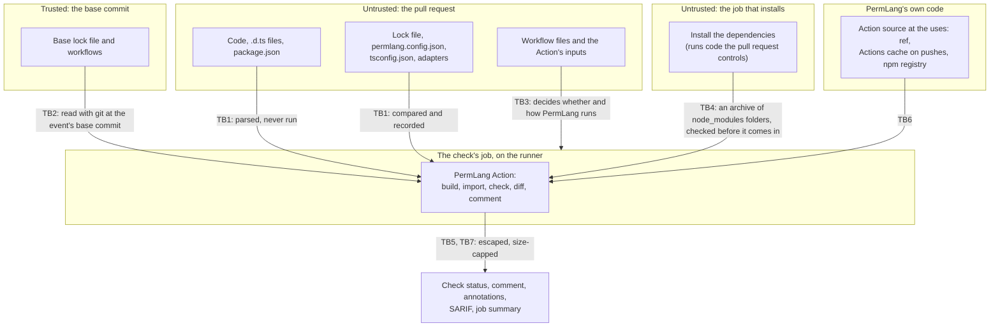

# PermLang threat model

What could go wrong with PermLang, who might try to make it go wrong, and why its defences hold.

Last reviewed: 2026-10-07, for version 0.4.3

1. [How to read this](#how-to-read-this)
2. [What PermLang promises, and what it doesn't](#what-permlang-promises-and-what-it-doesnt)
3. [Assets](#assets)
4. [Threat actors](#threat-actors)
5. [Trust boundaries](#trust-boundaries)
6. [Attack surface and threats](#attack-surface-and-threats)
7. [Security assessment](#security-assessment)
8. [Vulnerabilities found and fixed](#vulnerabilities-found-and-fixed)
9. [Secure design principles](#secure-design-principles)
10. [Common weaknesses countered](#common-weaknesses-countered)
11. [Keeping this current](#keeping-this-current)

## How to read this

This is PermLang's security assessment, its threat model and attack surface
analysis, and its assurance case: the argument that it meets its security
requirements. [design.md](design.md) describes the architecture, the
[actors](design.md#actors), and every [interface](design.md#external-interfaces);
this document doesn't repeat them.

| Requirement | Where it's met |
| --- | --- |
| OpenSSF OSPS Baseline OSPS-SA-03.01 (security assessment) | [Security assessment](#security-assessment) |
| OSPS-SA-03.02 (threat modeling and attack surface analysis) | [Threat actors](#threat-actors), [trust boundaries](#trust-boundaries), [attack surface](#attack-surface-and-threats), and what it has found: [vulnerabilities found and fixed](#vulnerabilities-found-and-fixed) |
| OpenSSF Best Practices `assurance_case` | This whole document: threat model (sections 4 to 6), trust boundaries (5), secure design principles (9), common weaknesses (10) |
| OpenSSF Best Practices `documentation_security` | [What PermLang promises, and what it doesn't](#what-permlang-promises-and-what-it-doesnt) |

**The argument in short.** PermLang's main security requirement: a pull request
that adds access fails the check, or shows the access in the comment, unless it
uses a documented [known limit](reference.md#known-limits). That holds because:

1. PermLang treats everything in the repository as data. It never runs it.
2. Everything that decides the verdict is recorded in the lock file, and the
   check compares all of it, exactly, with what the code does now.
3. The base commit decides which lock file counts, not the pull request.
4. Text from the code is escaped wherever PermLang shows it, so it can't add rows,
   links, mentions, or lines of its own to the comment, annotations, or logs.
5. The code that judges a change comes from outside that change, and nothing
   from the change runs in the job that judges it.

Sections 5 to 10 back each point, and say where it stops.

## What PermLang promises, and what it doesn't

### A passing check

On a pull request, the GitHub Action runs `permlang check --base <base commit>`
([action.yml](../action.yml)). When that passes:

- The lock file records exactly what the code reaches, function by function, and
  what the workflows, Actions, and `package.json` scripts grant. Not more, not less
  ([src/lock.ts](../src/lock.ts)).
- The lock also records which files were checked, the settings in effect (from the
  config file, the command line, or the Action's inputs), the TypeScript options that
  decide what an import is, each adapter with a hash of its content, and the code
  PermLang can't check ([src/settings.ts](../src/settings.ts),
  [src/unchecked.ts](../src/unchecked.ts)). The check ran with all of these.
- The lock file is one the base commit's workflows check with, and the base's own
  lock file wasn't deleted or left behind ([src/lock-moves.ts](../src/lock-moves.ts)).
- At `development` and `production` strictness, functions stay within their `@perm`
  tags, and the functions that level covers have them
  ([strictness levels](reference.md#strictness-levels)). Flow rules hold at every level.

The comment lists every difference between the base commit's lock and what the code
reaches now, new access first. When the list is incomplete (the code couldn't be
analyzed, the lock was deleted or moved, the comment had to be cut), it says so at
the top. It never says "No permission changes" then ([src/diff.ts](../src/diff.ts)).

### What a passing check doesn't mean

- **That the access is fine.** PermLang shows access; people approve it by committing
  the updated lock. Anyone who can push to the branch can update the lock. Review and
  branch protection decide whether that lands, not PermLang.
- **That nothing was missed.** It's static analysis, with
  [known limits](reference.md#known-limits) that are listed and tested.
- **That packages are safe.** Packages are judged by their adapters, which PermLang
  trusts as written. A package with no adapter is trusted once the lock records it.
  Code in `node_modules` isn't analyzed.
- **That the workflow ran PermLang.** On `pull_request`, GitHub runs the workflow as
  the pull request has it. See [protect the workflow itself](reference.md#github-action).
- **That AI tools are safe.** A risky tool gets a `PERM008` warning. Set
  `"tools": "error"` to fail on it.
- **Anything about the program at runtime.** PermLang never watches it run.

### What PermLang itself does

- **It never runs the code it checks.** It reads source through the TypeScript
  compiler API, via ts-morph ([src/load.ts](../src/load.ts)), which doesn't load the
  plugins a `tsconfig.json` can list. Config files, locks, and adapters are parsed as
  JSON, and workflows as YAML data ([src/adapters.ts](../src/adapters.ts),
  [src/yaml-nodes.ts](../src/yaml-nodes.ts)). Nothing in `src/` imports or
  `require`s a project's files.
- **The only program its commands start is `git`**, called directly, without a
  shell, to read the repository ([src/main.ts](../src/main.ts),
  [src/lock-moves.ts](../src/lock-moves.ts), [src/init-workflow.ts](../src/init-workflow.ts)).
  The Action's import step also runs `tar`, the same way, to unpack the
  dependencies archive ([src/dependencies.ts](../src/dependencies.ts)).
- **The command line sends nothing anywhere.** It has no network code. PermLang
  checks itself with `"unmapped": "error"`, and [its own lock](../permlang.lock.json)
  records no `net` access. It reads two environment variables, `GITHUB_WORKSPACE`
  and `GITHUB_ACTIONS`.
- **The GitHub Action talks to GitHub**, and to npm and Node's download site only
  to set itself up ([design.md](design.md#files-written-processes-and-network)). It
  sends its results: the comment, annotations, the job summary, and SARIF if you ask.
  These quote names, paths, and short pieces of code.
- **It writes only the files a command names**: the lock, `init`'s config and
  workflow, and the SARIF and summary files you ask for. The Action's import step
  adds the dependencies archive's `node_modules` folders to the checkout, as new
  folders only.

## Assets

| Asset | Why it matters |
| --- | --- |
| **The verdict**: the check's status, the comment, annotations, and job summary | Reviewers approve what these show. A pass that hides new access is the worst failure. |
| **The lock and the check's settings**: `permlang.lock.json`, `permlang.config.json`, `tsconfig.json`, adapters, the Action's `args` and `strictness` | They define "approved". Loosening any of them unseen would approve access without review. |
| **The Action's token and the runner** | With the permissions the workflow gives it, the job's `GITHUB_TOKEN` can write comments (`pull-requests: write`) and code-scanning alerts. The runner holds the checkout and PermLang's own build. |
| **The dependencies archive**: the `node_modules` folders another job installs and uploads | Built by code the pull request controls. What comes in from it is read only as types, and must not change the checkout's files, which the check reads as the pull request's code. |
| **PermLang as people run it**: the npm package, the Action at each tag and commit, the `v0` tag, the [release workflow](../.github/workflows/release.yml), and `main` | A compromised release would judge every project that uses it. |
| **Users' source code** | It must stay where it is. PermLang only quotes small parts of it, to GitHub, in results. |

## Threat actors

| Actor | Wants to | Can | Main defence |
| --- | --- | --- | --- |
| **Pull-request author**, a person or an AI coding agent, careless or malicious, possibly from a fork | Add access without the check failing or the comment showing it; loosen the check | Change any file: code, lock, config, `tsconfig.json`, adapters, `package.json`, workflows; run code while dependencies install | The exact lock comparison, the base commit's lock, escaped output, nothing from the pull request running in the check's job, and the [protected workflow](reference.md#github-action) |
| **A compromised dependency** of the user's project | Run code, or reach the network, inside the user's app | Ship new code under a known name, or arrive by alias, URL, or override | PermLang sees packages only through adapters. The comment lists new dependencies, changed sources, and overrides ([src/deps.ts](../src/deps.ts)); calls into a package with no adapter fail until the lock records them ([src/unchecked.ts](../src/unchecked.ts)). |
| **Hostile repository content**, aimed at PermLang itself | Crash it, hang it, make it misreport, read other files, or run code on the runner | Craft `tsconfig.json`, `package.json`, YAML, huge or deeply nested files, odd Unicode, links | Data-only parsing, fail-closed errors, escaping, and limits on recursion ([section 6](#attack-surface-and-threats)) |
| **Supply-chain attacker** against PermLang | Ship a PermLang that passes everything | Target its dependencies, the Actions it uses, the release pipeline, or the npm account | Actions pinned by commit, installs without install scripts, split build and publish jobs, signed provenance ([TB9](#trust-boundaries)) |
| **A pull request to PermLang itself** | Change how its own new access is judged | Edit PermLang's detection and its own lock together | A second check by the last release, pinned by commit ([TB8](#trust-boundaries)) |
| **Any GitHub user who can comment** | Post a fake "permission diff" | Comment on the pull request | The Action edits only its own account's comment; the check status is what counts |

An AI model's input (a user, a web page, an email) is a threat to the user's
application, not to PermLang. Reporting that risk is one of PermLang's
[features](reference.md#tools-given-to-ai-models).

## Trust boundaries

| | Boundary | What crosses it | How it's enforced | What PermLang trusts |
| --- | --- | --- | --- | --- |
| TB1 | Repository content into the analysis | All source, config, lock, workflow, and `package.json` text | Parsed as data. Unknowns become "unverifiable" or "unchecked" and are recorded, not skipped. | Nothing in it |
| TB2 | Base commit and pull request | Which lock file counts, and whether it may be missing | The Action passes `--base` with the base commit from the pull-request or merge-group event. The base's lock is then required, and moving away from it fails ([src/main.ts](../src/main.ts), [src/lock-moves.ts](../src/lock-moves.ts)). If the base can't be fetched, the lock is required anyway. | The base commit, which was reviewed when it merged |
| TB3 | The workflow definition | Whether PermLang runs, with which inputs | The lock records the workflow's permissions, triggers, and Actions, and the files and settings that the Action's `args` and `strictness` choose. Whether PermLang runs at all is up to branch protection: a required check, or a required workflow, and code owners for `.github/workflows/`. | The repository's branch protection |
| TB4 | The job that installs, and the check's job | The dependencies archive: the project's `node_modules` folders | The workflow `init` writes installs in a job of its own, with a read-only token, and the check's job runs nothing from the pull request. The Action unpacks the archive in a new folder, and brings in only `node_modules` folders (and the folders `generated` names), as new folders, with links that stay in the repository and out of `.git`; anything else refuses the whole archive. The check's job has `if: always()`, so a failed install fails it instead of skipping it ([src/dependencies.ts](../src/dependencies.ts), [src/init-workflow.ts](../src/init-workflow.ts)). PermLang runs on Node 22 by its full path. | That nothing from the pull request runs before the Action in the check's job; in the workflow `init` writes, nothing does |
| TB5 | PermLang and the GitHub API | The comment, SARIF, the base-commit fetch | Of the Action's own scripts, the comment step gets the token, and the base-commit fetch does when the checkout kept no credentials. The Action edits only comments by its token's own account, with its folder's marker. A fork's token is read-only, so the diff goes to the job summary. | GitHub's API and token scopes |
| TB6 | PermLang's own code | The Action's source, its cached build, its npm dependencies | Users pick the ref in `uses:`; [reference.md](reference.md#github-action) recommends a commit. The Action's own steps are pinned by commit. Its build is cached under a hash of its own sources and the runner's OS only on pushes, and scheduled and manual runs; pull requests and merge-queue entries build it from the sources, since a pull request can write to the cache it reads first. | The Action ref, GitHub's cache on pushes, and npm |
| TB7 | Output to reviewers | Names, paths, capabilities, and reasons from the code | Escaped for Markdown, HTML, and workflow commands; each value cut to 500 characters; the comment kept under GitHub's limit ([src/diff.ts](../src/diff.ts), [src/report.ts](../src/report.ts)) | Nothing from the code |
| TB8 | PermLang's own pull requests | PermLang's detection and its own lock | Two required jobs in [permlang.yml](../.github/workflows/permlang.yml): `permissions` runs the pull request's own copy (`uses: ./`); `released` runs the last release, pinned by commit, with a read-only token, against [permlang.released.lock.json](../permlang.released.lock.json), with the dependencies installed in a job of their own | The pinned release |
| TB9 | Building and publishing a release | The package bytes, the npm publish right, the `v0` tag | The `build` job runs dependencies' code with read-only access and no stored credentials. The `publish` job installs nothing; it attests and publishes that same tarball with npm trusted publishing (OIDC), and moves `v0` only for the newest release. Releases must be tagged on a commit on `main` ([release.yml](../.github/workflows/release.yml), [releasing.md](releasing.md)). | GitHub, npm, and the maintainer's accounts |

In PermLang's own repository, as of the review date, `main` requires pull requests
that pass the test jobs, both PermLang jobs, lint, CodeQL, the SBOM and
reproducible-build jobs, dependency review, and the sign-off check, for
administrators too, and allows no force pushes.

## Attack surface and threats

Each critical code path, with the threat, the defence and its evidence, and what's
left over. The [adversarial suite](../test/adversarial.test.ts) holds 287 ways of
hiding access that must be caught, 71 harmless cases that must stay silent, and 2
known misses whose tests fail once fixed. More known misses are fixtures in
[fixtures/m4/limits](../fixtures/m4/limits) and [fixtures/m6/limits](../fixtures/m6/limits).

**Project loading** ([src/load.ts](../src/load.ts), [src/settings.ts](../src/settings.ts))
- *Threat:* a `tsconfig.json` that narrows `include`, remaps `paths`, turns off import
  resolution, or extends another file; a file the parser can't handle.
- *Defence:* the lock records the files `tsconfig.json` selects after `extends`, and the
  compiler options that decide what an import is, with the values TypeScript works out.
  Imports are followed even with `noResolve`. A file the check starts from that the
  parser overflows on is read as an empty module and reported as unverifiable; one
  reached only through imports stops the check. A broken `tsconfig.json`, or one that
  selects no files, stops the check with exit code 2 ([test/gate.test.ts](../test/gate.test.ts),
  [test/settings.test.ts](../test/settings.test.ts), [test/engine.test.ts](../test/engine.test.ts)).
- *Left over:* only the listed compiler options are recorded; per-file JSX pragmas aren't.

**The walker and call graph** ([src/walk.ts](../src/walk.ts), [src/graph.ts](../src/graph.ts), [src/dispatch.ts](../src/dispatch.ts))
- *Threat:* hiding access behind aliases, callbacks, interfaces, getters, decorators,
  or code nested deep enough to overflow a recursive walk.
- *Defence:* iterative walks; calls followed through aliases, interfaces, callable
  types, and collections; the adversarial suite.
- *Left over:* the [known limits](reference.md#known-limits), such as values typed
  `any`, `Proxy` traps, and functions attached after the fact.

**Detectors and adapters** ([src/detect/](../src/detect), [src/adapters.ts](../src/adapters.ts), [adapters/](../adapters))
- *Threat:* a package PermLang doesn't know; an adapter that declares a package pure; a
  cast to `any`; a module name built at runtime; SQL written to look narrower than it is.
- *Defence:* calls into packages with no adapter, and imports with no types, are
  recorded and fail until locked ([test/unmapped.test.ts](../test/unmapped.test.ts));
  a team's adapters are recorded by content hash; computed access is unverifiable; the SQL reader
  answers "any table" when unsure ([test/properties.test.ts](../test/properties.test.ts),
  [test/sql.test.ts](../test/sql.test.ts)); Prisma is recognized by its package, not by a path.
- *Left over:* adapters are trusted as written, and a package with no adapter is trusted
  once recorded.

**`@perm` and `@perm-unsafe`** ([src/annotations.ts](../src/annotations.ts), [src/capability.ts](../src/capability.ts))
- *Threat:* malformed or misleading tags; an override that silences checks.
- *Defence:* the raw comment is scanned, and only tags that start a line count. Parsing
  never throws, and formatting round-trips (property tests). Each `@perm-unsafe` is
  recorded in the lock with its reason, and a new, removed, or reworded one fails. Flow
  rules ignore it.
- *Left over:* the lock records what code reaches, not what it declares, so loosening a
  `@perm` tag doesn't show in the comment. New access still changes the lock.

**Lock read, write, and diff** ([src/lock.ts](../src/lock.ts))
- *Threat:* a hand-edited lock that approves access in advance; a malformed lock; keys
  named `__proto__` or `toString`; merge-conflict markers.
- *Defence:* the lock must match the code in both directions. It's parsed into objects
  with no prototype, and anything malformed is a `LockError`, never a crash. A lock in
  an older format fails once ([test/gate.test.ts](../test/gate.test.ts), lock properties
  in [test/properties.test.ts](../test/properties.test.ts)).
- *Left over:* adding a same-named function can renumber keys (`#2`), which shows as noise.

**Moving or dropping the lock** ([src/lock-moves.ts](../src/lock-moves.ts), `check --base` in [src/main.ts](../src/main.ts))
- *Threat:* deleting the lock, `--no-lock`, pointing the check at a new lock file or
  folder that approves everything.
- *Defence:* with `--base`, a lock the base has is required, and a check that stops
  using any lock file the base's workflows check with fails, with a warning at the top
  of the comment. Only a PermLang step that's sure to run, and to fail its job when it
  fails, counts as still checking with a lock, so a step that never runs can't stand
  in for the real check ([test/base.test.ts](../test/base.test.ts), [test/action.test.ts](../test/action.test.ts)).
- *Left over:* the rule reads workflows as written: steps whose inputs are expressions,
  reusable workflows in other repositories, and `actions/checkout` with `path:` aren't
  understood. On a push, a deleted lock isn't detected.

**Flow rules** ([src/flows.ts](../src/flows.ts))
- *Threat:* a secret leaving through a helper, a callback, `exec`, `eval`, or a package
  PermLang can't see into.
- *Defence:* `PERM009` at every strictness; commands, unverifiable code, and unchecked
  packages count as "anywhere"; rules that could never match are configuration errors
  ([test/flows.test.ts](../test/flows.test.ts)).
- *Left over:* rules work per function and don't follow the value itself
  ([details](reference.md#data-flow-rules)).

**AI tool detection** ([src/tools.ts](../src/tools.ts))
- *Threat:* registering a tool in a form PermLang doesn't recognize.
- *Defence:* framework families, not single package names; a collection that can't be
  listed becomes an unverifiable tool with a warning; new access a tool reaches is
  marked in the comment ([test/tools.test.ts](../test/tools.test.ts)).
- *Left over:* only the listed frameworks. By default `PERM008` only warns, and a new
  tool that reaches nothing new doesn't change the lock.

**Workflows, Actions, and `package.json`** ([src/project-files.ts](../src/project-files.ts), [src/workflow-files.ts](../src/workflow-files.ts), [src/yaml-nodes.ts](../src/yaml-nodes.ts), [src/ci-expressions.ts](../src/ci-expressions.ts))
- *Threat:* hiding a permission, secret, trigger, or unpinned Action with YAML anchors,
  merge keys, `${{ 'text' }}`, odd casing, invisible line breaks, files PermLang can't
  read, or links.
- *Defence:* YAML is read the way GitHub reads it (YAML 1.2 core schema, aliases
  resolved, keys included). Secrets are found with a lexer modeled on GitHub's, in any
  case and spacing; any other use is `ci.secret(all)`. U+0085, U+2028, and U+2029 make a
  file unverifiable. A file PermLang can't read, or a broken link, is recorded with its
  hash. Folder links are followed once each. A local Action outside the repository is
  unpinned ([test/project-files.test.ts](../test/project-files.test.ts), [test/properties.test.ts](../test/properties.test.ts)).
- *Left over:* `run:` commands, Dockerfiles, package managers' own config files, and
  remote Actions' contents aren't read ([known limits](reference.md#known-limits-1)).

**Comment, annotations, SARIF, and logs** ([src/diff.ts](../src/diff.ts), [src/report.ts](../src/report.ts), [action.yml](../action.yml))
- *Threat:* text from the code that breaks out of a table or code span, hides rows in an
  HTML comment, mentions people, adds links, reverses text with bidirectional controls,
  starts a workflow command, or pushes new access out of a long comment; a planted
  comment with PermLang's marker; a stale comment.
- *Defence:* every value is escaped for HTML and Markdown, with a zero-width space to
  stop mentions and links. Line breaks and control characters become visible escapes, so
  a value can't start a line of its own. Annotations use GitHub's own escaping, and SARIF
  is written as JSON. In GitHub Actions, PermLang tells the runner to ignore workflow
  commands while it prints, until a token only that run knows. The comment stays under
  60,000 bytes, new access first, cells cut to 500 characters and 20 names, and the full
  diff goes to the job summary. The Action updates only its own account's comment, and
  fails the step if that update fails, or if the diff prints nothing
  ([test/properties.test.ts](../test/properties.test.ts), [test/comment.test.ts](../test/comment.test.ts),
  [test/action.test.ts](../test/action.test.ts), [test/sarif.test.ts](../test/sarif.test.ts)).
- *Left over:* comments by other accounts can imitate PermLang's; on a fork's pull
  request the Action posts none, so any such comment there is someone else's.

**Paths** ([src/capability.ts](../src/capability.ts), [src/project-files.ts](../src/project-files.ts), [src/init-workflow.ts](../src/init-workflow.ts))
- *Threat:* `..` climbing out of an approved folder; Windows drives and network shares;
  `uses: ./../..`; links and junctions.
- *Defence:* a path covers only itself and what's beneath it, `..` can't climb above a
  drive or share (property tests); a local Action must be inside the repository; `init`
  refuses paths outside it; link loops end.
- *Left over:* paths in settings can name files anywhere, as the repository's own
  config chooses. A dependency's name that npm wouldn't allow (`../x`, say) is treated
  as not installed, so its lookup stays under `node_modules`.

**Resource exhaustion** ([src/walk.ts](../src/walk.ts), [src/load.ts](../src/load.ts), [src/detect/sql-tables.ts](../src/detect/sql-tables.ts), [src/detect/drizzle.ts](../src/detect/drizzle.ts), [src/yaml-nodes.ts](../src/yaml-nodes.ts))
- *Threat:* deep nesting, huge files, YAML alias bombs, regular expressions that
  backtrack, very long text.
- *Defence:* iterative walks, and unverifiable instead of a crash; the SQL reader gives up
  at depth; scanners written as loops where a regular expression could backtrack; YAML
  is never expanded into objects, and aliases are followed only along the keys GitHub
  reads, each node once; propagation is linear, and so is reading `@perm` tags and
  `package.json` scripts, even tens of thousands of them ([test/engine.test.ts](../test/engine.test.ts),
  [test/sql.test.ts](../test/sql.test.ts), [test/report.test.ts](../test/report.test.ts),
  [test/large-inputs.test.ts](../test/large-inputs.test.ts)).
- *Left over:* there's no size limit, and interface matching grows faster than the
  input ([known limits](reference.md#known-limits)). The worst case is a slow or failed
  check, never a pass. No test yet pins the YAML alias case.

**The Action's own steps** ([action.yml](../action.yml))
- *Threat:* script injection through inputs, glob expansion of `args`, a changed Node,
  token exposure.
- *Defence:* inputs reach scripts only through environment variables; `args` is split
  with globbing off; Node 22 is called by its full path; of its own scripts, only the
  comment step and the base-commit fetch get the token; every Action it uses is pinned
  by commit; its build cache is used only where a pull request can't have written it;
  any non-zero exit fails the job.
- *Left over:* it trusts the runner, its tool cache, the Actions cache on pushes, and
  whatever a workflow runs before it in the check's job; the workflow `init` writes
  runs nothing there ([TB4, TB6](#trust-boundaries)).

**Importing the dependencies** ([src/dependencies.ts](../src/dependencies.ts), [action.yml](../action.yml), [src/init-workflow.ts](../src/init-workflow.ts))
- *Threat:* an archive, built by code the pull request controls, that brings in more
  than `node_modules`: a file that replaces one of the pull request's own, a path
  with `..`, a link out of the repository or into `.git`, a link on the way to a
  destination; or an install that fails on purpose, so the check's job is skipped.
- *Defence:* the archive is unpacked in a new folder, and every entry, link, and
  destination is checked before anything moves; anything else refuses the whole
  archive, and Windows runners are refused, since their `tar` copies a link's target.
  The check's job runs even when the install fails, and fails then, saying why
  ([test/dependencies.test.ts](../test/dependencies.test.ts), [test/action.test.ts](../test/action.test.ts),
  [test/init.test.ts](../test/init.test.ts)).
- *Left over:* the types PermLang reads come from what the pull request installs.
  Without `@types/node`, say, Node's modules become imports with no types: code
  PermLang can't check, which the lock records and the comment shows as such, rather
  than as file, process, or environment access.

### STRIDE summary

| | Example threat | Main defence | Left over |
| --- | --- | --- | --- |
| **Spoofing** | A look-alike comment; a look-alike Action (`someone/permlang`) | Own-account comment edits; only PermLang's Action counts for the lock-move rule; branch protection can require the check from GitHub Actions | Other accounts' comments; a pull request's workflow can define a job with the required name |
| **Tampering** | Editing the lock, settings, workflow, or PermLang's own detection; code that runs while installing | Exact lock match; settings and inputs recorded; base lock required; check by the pinned release; installing in a job of its own | The workflow under `pull_request`; steps a workflow runs before PermLang in the check's job; the runner |
| **Repudiation** | "Nobody approved this" | Every approval is a lock change in git history, next to the comment; `@perm-unsafe` needs a recorded reason | Who approved is GitHub's record, not PermLang's |
| **Information disclosure** | Code leaving the machine; reading files elsewhere | No network code in the CLI; results only to GitHub; values cut to 500 characters | Results quote names, paths, and short code; error messages can quote a few characters of a file the settings name |
| **Denial of service** | Deep nesting, huge files, alias bombs, backtracking | Iterative walks, depth limits, loop scanners, unverifiable instead of crashing | No size limit; worst case a slow or failed check |
| **Elevation of privilege** | Repository content running with the job's token | Never runs analysed code; `git` and `tar` without a shell; inputs through the environment; least-privilege tokens; installing in a job with a read-only token | Steps a workflow runs before PermLang in the check's job; in PermLang's own repository, `uses: ./` runs the pull request's Action (with a read-only token for forks) |

## Security assessment

The most likely and most damaging problems, ranked by how likely they are times how
much harm they'd do.

| # | Problem | Likely | Harm | Current defence | If the defence fails |
| --- | --- | --- | --- | --- | --- |
| 1 | **New access through code the analysis doesn't see.** An agent or a person writes, by chance or on purpose, a form PermLang misses. | High | High | Adversarial suite; computed access is unverifiable, not ignored; unknown packages and imports recorded; known limits documented with tests | The access lands with no change to the lock. Code review is the only remaining check. |
| 2 | **A reviewer approves without reading.** The author relocks, and the lock change is waved through. | High | High | New access first in the comment, with where it happens and what reaches it; AI-triggerable access marked; "Approving this change approves the access above" | PermLang did its job, but the access is approved. Code owners for the lock help. |
| 3 | **The pull request changes how PermLang runs**: removes the step, adds `continue-on-error`, changes inputs, or moves the lock. | Medium | High | Inputs and settings recorded; `--base` and the lock-move rule; workflow permissions and Actions recorded; [protect the workflow](reference.md#github-action) | Only branch protection is left: a required check or a required workflow, and code owners for `.github/workflows/`. |
| 4 | **PermLang's own code or runtime is tampered with**: code that runs while installing, an earlier step in the job, the runner, the build cache, or the Action ref. | Low to medium | Very high | Installing in a job of its own, with only `node_modules` folders coming in; the check's job failing when installing fails; the build cache used only on pushes; pinned Actions; install without install scripts; Node by full path; commit pins recommended | The check can pass and the comment can say anything. Run nothing from the pull request before PermLang in its job, and pin the Action by commit. |
| 5 | **Output misleads reviewers**: hidden rows, fake rows, mentions, workflow commands, a stale comment. | Medium | Medium | Escaping everywhere, property-tested; size cap with new access first; own-comment rule | The check status is still right. Reviewers may misread the comment. |
| 6 | **A release of PermLang is compromised**: npm account, release workflow, or the `v0` tag. | Low | Very high | OIDC trusted publishing; npm set to 2FA with tokens disallowed ([releasing.md](releasing.md)); build and publish split; releases only from `main`; signed provenance ([SECURITY.md](../SECURITY.md#verifying-a-release)) | Users on `@v0` or a version range run it. Users pinned to a commit, or who verify provenance, don't. |
| 7 | **Resource exhaustion.** A pull request makes the check slow or crash. | Medium | Low | Iterative walks, depth limits, loop scanners | The check fails or times out. It never passes. |
| 8 | **Information disclosure.** Results quote code; settings can name files anywhere. | Low | Low | Results go only to GitHub, cut to 500 characters per value | A few characters of a file the settings name can appear in an error. A pull request's workflow could read such files anyway. |

## Vulnerabilities found and fixed

Writing this threat model found four vulnerabilities, all in how PermLang runs in
GitHub Actions rather than in its analysis. Each was fixed privately, released, and
published as a GitHub security advisory the same day, as [SECURITY.md](../SECURITY.md)
describes. Checking the first fix on PermLang's own workflow then found a fifth, in
that fix.

| Advisory | Severity | What it was | Fixed in |
| --- | --- | --- | --- |
| [GHSA-chh9-p8fq-3gf9](https://github.com/PermLang/PermLang/security/advisories/GHSA-chh9-p8fq-3gf9) | High | The workflow `init --workflow` wrote installed dependencies in the check's job, before it; installing runs code the pull request controls, even with install scripts off (TB4). | 0.4.2 |
| [GHSA-2vhg-398w-7p59](https://github.com/PermLang/PermLang/security/advisories/GHSA-2vhg-398w-7p59) | High | On a pull request, the Action restored its own build from a cache the pull request could write to (TB6). | 0.4.2 |
| [GHSA-h4jc-gqvh-2675](https://github.com/PermLang/PermLang/security/advisories/GHSA-h4jc-gqvh-2675) | Moderate | A PermLang step that never runs counted as still checking with the base's lock, so a pull request could move the real check to a lock of its own (TB2). | 0.4.2 |
| [GHSA-86xw-2f2v-g8vw](https://github.com/PermLang/PermLang/security/advisories/GHSA-86xw-2f2v-g8vw) | Low | A file path starting with `::` could start a workflow command in the job log, hiding annotations (TB7). | 0.4.2 |
| [GHSA-86ff-3f4h-rrjp](https://github.com/PermLang/PermLang/security/advisories/GHSA-86ff-3f4h-rrjp) | Low | In 0.4.2's two jobs, a failed install skipped the check's job, which a required check counts as passed (TB4). | 0.4.3 |

The same review also fixed, as hardening, the problems it rated too small for an
advisory: a stale comment when the diff died, a capability named `constructor`
stopping the diff, a dependency named `../x`, and slow reading of very many `@perm`
tags or scripts ([CHANGELOG.md](../CHANGELOG.md#042-2026-10-07)).

## Secure design principles

From Saltzer and Schroeder, with the evidence for each.

- **Fail-safe defaults.** Anything PermLang can't decide fails or is recorded. Every
  difference between code and lock is an error, at every strictness level. Unknown
  config keys, options a command doesn't take, a missing `--lock` file, and a broken
  `tsconfig.json` all exit 2, and the Action fails on any non-zero exit. Code it can't
  analyze is unverifiable, SQL it can't read is "any table", YAML it can't read is
  recorded with its hash, and an incomplete diff never says "No permission changes"
  ([src/lock.ts](../src/lock.ts), [src/args.ts](../src/args.ts), [test/gate.test.ts](../test/gate.test.ts)).
- **Least privilege.** Every workflow starts read-only (`contents: read`, or `read-all`
  for Scorecard) and grants more only to the job that needs it
  ([.github/workflows/](../.github/workflows)). The release's `build` job has read-only
  access and keeps no credentials; only the `publish` job can publish, and it runs no
  dependency's code. npm publishing uses OIDC, with no stored token. Of the Action's own
  scripts, only the comment step and the base-commit fetch get the token, and the job
  that installs a project's dependencies has a read-only one. The command line reads two
  environment variables and writes only the files it's told to.
- **Complete mediation.** Each check re-analyzes the code and compares the whole result
  with the whole lock, including settings, checked files, compiler options, unchecked
  code, and overrides. The comment compares the base's lock with what the code reaches
  now, not with the pull request's own lock.
- **Economy of mechanism.** One gate, the lock comparison (`PERM005`), covers code,
  workflows, scripts, settings, and unchecked code. Adapters are JSON, not plug-in code.
  PermLang has two runtime dependencies, ts-morph and yaml ([package.json](../package.json)).
- **Open design.** The code, the rules, the adversarial suite, and every known limit are
  public. Nothing depends on the rules being secret.
- **Separation of privilege.** Approving access takes a lock change that a reviewer sees
  and that branch protection must let through. In PermLang's own repository, a change
  must pass both its own copy and the pinned last release. A release needs a tag on a
  commit already on `main`, and npm accepts a publish only from the release workflow
  or from a maintainer with two-factor authentication ([releasing.md](releasing.md)).
- **Least common mechanism.** The command line keeps no cache or temporary files. Each
  folder of a monorepo gets its own comment and code-scanning category. The Action's one
  shared resource is its build cache, keyed by its own sources, and read only on pushes
  and scheduled and manual runs, which a pull request's jobs can't write to.
- **Psychological acceptability.** It starts at `sketch` and tightens later. Messages
  point at the line and say how to fix it. Approving is `permlang lock` and a commit,
  like updating `package-lock.json`.

## Common weaknesses countered

| Weakness | Where it could arise | What PermLang does | Evidence |
| --- | --- | --- | --- |
| CWE-94, CWE-95: code injection; running the analysed code | Analysis, config, adapters | Reads everything as data; TypeScript's compiler API; no plugin loading; nothing imports project files | [src/load.ts](../src/load.ts), [src/adapters.ts](../src/adapters.ts) |
| CWE-78: OS command injection | Running `git`; the Action's scripts | `git` called without a shell, arguments as a list, refs after `--end-of-options`, option values can't start with `-`; Action inputs reach scripts only through the environment, with globbing off | [src/main.ts](../src/main.ts), [src/args.ts](../src/args.ts), [action.yml](../action.yml), [test/gate.test.ts](../test/gate.test.ts) |
| CWE-74, CWE-117: injection into workflow commands and logs | Text report, annotations | Line breaks, control characters, Unicode line separators, and bidirectional controls become visible escapes; annotations use GitHub's escaping; in GitHub Actions, the runner ignores workflow commands while PermLang prints, but for its own annotations (GHSA-86xw-2f2v-g8vw) | [src/report.ts](../src/report.ts), [src/main.ts](../src/main.ts), [test/properties.test.ts](../test/properties.test.ts), [test/gate.test.ts](../test/gate.test.ts), [test/cli.test.ts](../test/cli.test.ts) |
| CWE-79, CWE-80: Markdown and HTML injection | The comment and job summary | Every value escaped for HTML and Markdown; mentions, issue links, URLs, and emoji codes broken with a zero-width space; the marker's folder name encoded | [src/diff.ts](../src/diff.ts), [test/comment.test.ts](../test/comment.test.ts) |
| CWE-451: misleading display | Bidirectional controls and other control characters | Shown as escapes such as `\u202e` | [src/report.ts](../src/report.ts) |
| CWE-22: path traversal | Local Actions, approved folders, `init`, dependency names, the dependencies archive | Local Actions must be inside the repository; `..` can't climb out of a folder, drive, or share; `init` refuses outside paths; a dependency name npm wouldn't allow is treated as not installed; the archive's entries must stay in `node_modules` folders | [src/project-files.ts](../src/project-files.ts), [src/capability.ts](../src/capability.ts), [src/dependencies.ts](../src/dependencies.ts), [test/properties.test.ts](../test/properties.test.ts), [test/dependencies.test.ts](../test/dependencies.test.ts) |
| CWE-59: link following | Workflow discovery, the dependencies archive | Folder links followed once each; a broken link recorded as unverifiable; the archive's links must be relative, stay in the repository, and keep out of `.git`, and no destination may have a link on the way | [src/project-files.ts](../src/project-files.ts), [src/dependencies.ts](../src/dependencies.ts), [test/project-files.test.ts](../test/project-files.test.ts), [test/dependencies.test.ts](../test/dependencies.test.ts) |
| CWE-400: resource consumption | Comment, summary, analysis | Comment under 60,000 bytes, summary under 1,000,000, 500 characters per value | [src/diff.ts](../src/diff.ts), [test/comment.test.ts](../test/comment.test.ts). No input size limit. |
| CWE-674: uncontrolled recursion | Parsing and walking deep code; SQL | Iterative walks; parser overflow becomes unverifiable; SQL reader gives up at depth | [src/walk.ts](../src/walk.ts), [src/load.ts](../src/load.ts), [test/engine.test.ts](../test/engine.test.ts), [test/sql.test.ts](../test/sql.test.ts) |
| CWE-1333: ReDoS | Scanning SQL fragments and messages from the code | Loops instead of backtracking expressions where it mattered; CodeQL checks for more | [src/detect/drizzle.ts](../src/detect/drizzle.ts), [test/sql.test.ts](../test/sql.test.ts), [test/report.test.ts](../test/report.test.ts) |
| CWE-776: YAML alias expansion | Workflows and Actions | The document is never expanded into objects; aliases are followed only along the keys GitHub reads, each node once | [src/yaml-nodes.ts](../src/yaml-nodes.ts), [src/workflow-files.ts](../src/workflow-files.ts) |
| CWE-1321: prototype pollution | Lock, config, `package.json` | Lock read into objects with no prototype and looked up by own keys; config keys checked against a list; adapter functions kept in a `Map` | [src/lock.ts](../src/lock.ts), [src/settings.ts](../src/settings.ts), [src/diff.ts](../src/diff.ts), [test/properties.test.ts](../test/properties.test.ts). The comment code looks names up by own keys too, since 0.4.2. |
| CWE-829, CWE-494: untrusted functionality and downloads | PermLang's dependencies and Actions; the project's install; the Action's build cache | Every Action pinned by commit (its own lock records no `ci.unpinned`); installs from the lockfile without install scripts; the project's install in a job apart from the check (GHSA-chh9-p8fq-3gf9); the Action's cached build used only on pushes (GHSA-2vhg-398w-7p59); Dependabot; signed provenance | [action.yml](../action.yml), [src/init-workflow.ts](../src/init-workflow.ts), [release.yml](../.github/workflows/release.yml), [SECURITY.md](../SECURITY.md#verifying-a-release) |
| CWE-636: not failing securely | A check that doesn't run | A failed install fails the check's job instead of skipping it (GHSA-86ff-3f4h-rrjp); an incomplete diff never says "No permission changes"; any non-zero exit fails the job | [src/init-workflow.ts](../src/init-workflow.ts), [action.yml](../action.yml), [test/init.test.ts](../test/init.test.ts) |
| CWE-693: protection mechanism failure (a bypass) | The gate | The lock comparison, `--base`, only steps sure to run counting for a moved lock (GHSA-h4jc-gqvh-2675), and the adversarial suite | [test/gate.test.ts](../test/gate.test.ts), [test/base.test.ts](../test/base.test.ts), [test/adversarial.test.ts](../test/adversarial.test.ts) |

The same ground in OWASP's terms: A03 Injection (the output rows), A08 Software and
Data Integrity Failures (release and Actions pinning), and from the OWASP Top 10 CI/CD
risks, CICD-SEC-4 Poisoned Pipeline Execution (TB3, TB4) and CICD-SEC-9 Improper
Artifact Integrity Validation (TB9).

**Not applicable:** CWE-89 SQL injection (PermLang has no database), CWE-287 and
CWE-352 authentication and CSRF (no server or accounts), CWE-798 hard-coded credentials
(none; publishing uses OIDC), CWE-502 unsafe deserialization (JSON and YAML are read as
plain data).

## Keeping this current

Review this document, and update "Last reviewed", when any of these happens:

- a new detector, adapter, AI framework, or kind of capability;
- a new input PermLang reads (a file type, a package manager's files, a workflow feature);
- a new output or channel (a comment section, an annotation type, a GitHub API call);
- a change to [action.yml](../action.yml) or the [workflows](../.github/workflows);
- a reported bypass ([SECURITY.md](../SECURITY.md));
- and before each minor release.

What keeps it honest between reviews:

- **The adversarial suite** ([test/adversarial.test.ts](../test/adversarial.test.ts)):
  caught, silent, and known-miss cases; a known miss's test fails once it's fixed.
- **Property tests** with fast-check ([test/properties.test.ts](../test/properties.test.ts)):
  27 rules that must hold for every input, from escaping to lock reading.
- **Tests that are known to bite.** Each new rule is broken on purpose before merging,
  to make sure a test notices ([CONTRIBUTING.md](../CONTRIBUTING.md)).
- **Static analysis and scoring.** CodeQL scans JavaScript, TypeScript, and the
  workflows (GitHub's default setup), and [OpenSSF Scorecard](../.github/workflows/scorecard.yml)
  runs weekly. Dependabot proposes updates weekly.
- **PermLang checks itself**, twice, on every pull request ([TB8](#trust-boundaries)).
- **A full code review in October 2026** found 79 problems, all fixed in 0.4.0. A
  second, independent round then re-checked those fixes, and what it found was fixed
  too ([CHANGELOG.md](../CHANGELOG.md#040-2026-10-06)).
- **This threat model's first review** found four vulnerabilities, fixed in 0.4.2,
  and a fifth in that fix, fixed in 0.4.3. Each fix was tested end to end on GitHub,
  in a private repository, before release
  ([vulnerabilities found and fixed](#vulnerabilities-found-and-fixed)).
- **A real-world trial** on two open-source apps ([trial-2026-09.md](trial-2026-09.md)).

Report anything that gets past PermLang privately, as [SECURITY.md](../SECURITY.md) describes.
